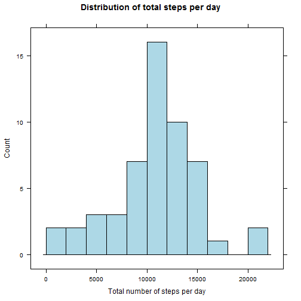
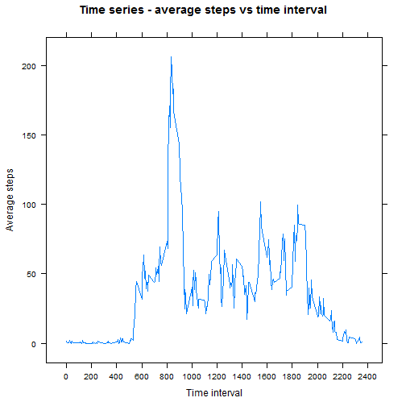
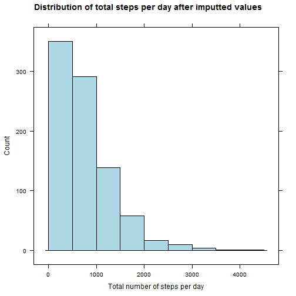
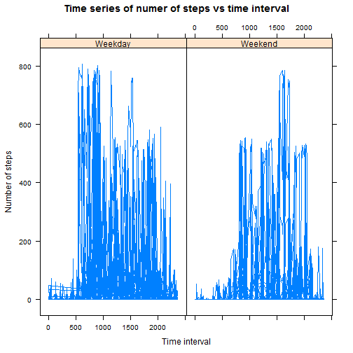

# Reproducible Research: Peer Assessment 1

Feri Guretno

## Introduction

It is now possible to collect a large amount of data about personal movement using activity monitoring devices such as a Fitbit, Nike Fuelband, or Jawbone Up. These type of devices are part of the "quantified self" movement - a group of enthusiasts who take measurements about themselves regularly to improve their health, to find patterns in their behavior, or because they are tech geeks. But these data remain under-utilized both because the raw data are hard to obtain and there is a lack of statistical methods and software for processing and interpreting the data.

This assignment makes use of data from a personal activity monitoring device. This device collects data at 5 minute intervals through out the day. The data consists of two months of data from an anonymous individual collected during the months of October and November, 2012 and include the number of steps taken in 5 minute intervals each day.

## Assignment

### Libraries
The following libraries were used throughout the code.

```r
library(lattice)
library(knitr)
library(xtable)
```


### Loading and preprocessing the data
Download the zip file from the link given on the assignment's instruction, Unzip it and read the csv data to R. Two filters was created for filtering rows with NA step's values 


```r
download.file("https://d396qusza40orc.cloudfront.net/repdata%2Fdata%2Factivity.zip", destfile = "./repdata-data-activity/activity.csv")
```

```
## Error in download.file("https://d396qusza40orc.cloudfront.net/repdata%2Fdata%2Factivity.zip", : unsupported URL scheme
```

```r
unzip("repdata-data-activity.zip", exdir = "./repdata-data-activity")

activity_data <- read.csv("./repdata-data-activity/activity.csv")

filter_steps <- activity_data$steps[!is.na(activity_data$steps)]
filter_date <- activity_data$date[!is.na(activity_data$steps)]
```

### What is mean total number of steps taken per day?

To calculate the total number of steps for each day using the tapply function, a factor vector was created to distinguish each date. Then a histogram was plotted.


```r
# get the total number of steps for each day
total_steps <- tapply(filter_steps, factor(filter_date), FUN = sum)

# plot a histogram of the total number of steps taken each day
histogram(total_steps, breaks = 10, 
          xlab = "Total number of steps per day", 
          main = "Distribution of total steps per day", 
          col = "lightblue", 
          type = "count")
```

 

The mean and median of the total number of steps taken per day was also calculated


```r
# mean and median of total steps
mean_total_steps <- mean(total_steps)
median_total_steps <- median(total_steps)
```

### What is the average daily activity pattern?

A time series plot of the 5-minute interval (x-axis) and the average number of steps taken, averaged across all days (y-axis) was created. The average steps were calculated using the tapply function on the factor variable of time interval and then rounded to two decimal places.


```r
interval <- activity_data$interval

# calculate the average number of steps for each 5 minute period
average_steps <- tapply(activity_data$steps, factor(interval), FUN = mean, na.rm = TRUE)
average_steps <- sapply(average_steps, simplify = array, round, 2)
    
   
# plot the time series
xyplot(as.numeric(average_steps) ~ interval[1:288], 
       type = "l", 
       xlab = "Time interval",
       ylab = "Average steps", 
       main = "Time series - average steps vs time interval", 
       scales = list( x=list(at = seq(0, 2400, 200))) )
```

 

To calculate which 5-minute interval, on average across all the days in the dataset, contains the maximum number of steps, the data frame was then sorted by average steps in descending order and the 1st row taken as the maximum ( converted to numeric).


```r
# create a data frame of average steps and time interval
interval_factor <- factor(interval)[1:nlevels(factor(interval))]
df_steps_interval <- data.frame(interval_factor, average_steps)

# sort df to get the row with the maximum amount of average steps
df_steps_interval <- df_steps_interval[order(df_steps_interval$average_steps, 
                                             decreasing = TRUE),]

# convert the factor to a character and then to numeric
max_time_interval <- as.numeric(as.character(df_steps_interval$interval_factor[1]))
```

### Imputing missing values

The total number of missing values in the dataset was computed with length function.


```r
steps <- activity_data$steps

# Calculate and report the total number of missing values in the dataset
length(steps[is.na(steps)])
```

```
## [1] 2304
```

These rows with NA values were assigned new values based on the corresponding 5 minute interval for the average steps that was computed previously. Using sapply , we can found the NA values, and then they were looped over, replacing each one by the corresponding value in the average steps data.


```r
# take a copy of the original steps vector
new_dataset_steps <- steps

# Devise a strategy for filling in all of the missing values in the dataset
for (i in which(sapply(new_dataset_steps, is.na))) {
  
  # set the value to the equivalent value in the average vector
  if (i <= 288){
    new_dataset_steps[i] <- average_steps[i]
  } 
  
  # wrap around 288 (avg time only has 24 hours of data) and add one because 
  # R is non-zero index
  else{
    new_dataset_steps[i] <- average_steps[i%%288 + 1]
  }
  
}
```
Then a new dataset that is equal to the original dataset but with the missing data filled in was created.


```r
#Create a new dataset that is equal to the original dataset but with the missing data filled in
new_activity_data <- activity_data
new_activity_data$steps <- new_dataset_steps
```

A histogram of the total number of steps taken each day and the mean and median of the new dataset also computed.


```r
# get the total number of steps for each day
new_dataset_total_steps <- tapply(new_dataset_steps, factor(new_dataset_steps), FUN = sum)

# plot a histogram of the total number of steps taken each day
histogram(new_dataset_total_steps, breaks = 10, 
          xlab = "Total number of steps per day", 
          main = "Distribution of total steps per day after imputted values", 
          col = "lightblue",
          type = "count")
```

 

```r
# calculate the mean and median of the distribution
new_dataset_mean <- mean(new_dataset_total_steps)
```

```
## [1] 755.7388
```


```r
new_dataset_median <- median(new_dataset_total_steps)
```

```
## [1] 612
```

Then the mean and median of the original and the new dataset was compared.

<!-- html table generated in R 3.1.2 by xtable 1.7-4 package -->
<!-- Thu Mar 12 23:49:45 2015 -->
<table border=1>
<tr> <th>  </th> <th> original_summary </th> <th> new_summary </th> <th> compare </th>  </tr>
  <tr> <td align="right"> mean </td> <td align="right"> 10766.19 </td> <td align="right"> 755.74 </td> <td align="right"> 7.02 </td> </tr>
  <tr> <td align="right"> median </td> <td align="right"> 10765.00 </td> <td align="right"> 612.00 </td> <td align="right"> 5.69 </td> </tr>
   </table>

These values are drastically different from the original dataset; The impact of imputting average values for missing values introduced a lot of bias into the dataset.

### Are there differences in activity patterns between weekdays and weekends?

The date vector was converted from factor type to date. Using the weekdays() function, the factor then run through the function to determine the day of the week. 

A new dataframe constructed for the 4 values of activity data. A new factor variable in the dataset with two levels - "weekday" and "weekend" indicating whether a given date is a weekday or weekend day was created and assigned as dayType in the new data frame.


```r
date <- as.Date(activity_data$date)
day_of_the_week <- weekdays(date)
weekendDays <- c("Saturday", "Sunday")

# construct a DF for these 4 values
DF <- data.frame(date, interval_factor, new_dataset_steps, day_of_the_week)
isWeekend <- DF$day_of_the_week %in% weekendDays
DF$dayType = factor(isWeekend,labels = c("Weekday","Weekend"))
```

Then a panel plot containing a time series plot of the 5-minute interval (x-axis) and the average number of steps taken, averaged across all weekday days or weekend days (y-axis) was created


```r
# plot the time series
xyplot(DF$new_dataset_steps ~ interval | DF$dayType, layout = c(2, 1), type = "l", 
       xlab = "Time interval", ylab = "Number of steps", 
       main = "Time series of numer of steps vs time interval" )
```

 
